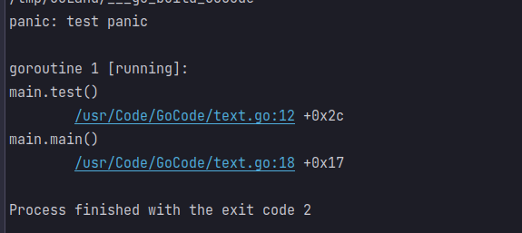

# 1.语法基础

## 1.例子

```go
//main函数 
package main

//使用fmt包  实现了IO函数
import "fmt"
//{不能单独放一行
func main() {
    //标识符以一个大写字母开头，可以被外部包的代码使用
    //小写开头，对包外不可见，protected修饰符
	fmt.Print("hello")
    //一行表示一个语句结束
    print("123")
}

```

如果你打算将多个语句写在同一行，它们则必须使用 ; 人为区分，但在实际开发中我们并不鼓励这种做法。

## 2.字符串可以使用`+` 连接

## 3.变量声明


`var age int`

## 4.格式化字符串

```go
package main

import "fmt"

func main() {
	var age = 123
	var date = "12.1"
	var url = "Code=%d date=%s"
	var result = fmt.Sprintf(url, age, date)
	fmt.Print(result)
}
```

## 5.数据类型

1.bool
`var b bool = true`

2.数字类型

> int float32 float64 ,支持复数,位运算采用补码
>
> uint8,16,32,64 无符号整型(后表示位)
>
> int8,16,32,64
>
> float32,64
>
> complex64,128 复数

byte,rune(类似int32),uint(32/64),uintptr(存放指针)

**go 1.9版本对于数字类型，无需定义int及float32、float64，系统会自动识别 （有点像python）。**

3.字符串类型

UTF-8 编码标识Unicode文本

4.**派生类型:**
包括：

- (a) 指针类型（Pointer）
- (b) 数组类型
- (c) 结构化类型(struct)
- (d) Channel 类型 (管道?)
- (e) 函数类型
- (f) 切片类型 
- (g) 接口类型（interface）
- (h) Map 类型

## 6.声明变量

### 1.var 关键字 (莫名js)

```go
var x1,x2 int  

var b,c int = 1, 2 (python!)
```

未初始化0,"",false

- 以下几种类型为 **nil**：

  ```go
  var a *int
  var a []int
  var a map[string] int
  var a chan int
  var a func(string) int
  var a error // error 是接口
  ```

格式化符号

> %b 一个二进制整数，将一个整数格式转化为二进制的表达方式
> %c 一个[Unicode](https://so.csdn.net/so/search?q=Unicode&spm=1001.2101.3001.7020)的字符
> %d 十进制整数
> %o 八进制整数
> %x 小写的十六进制数值
> %X 大写的十六进制数值
> %U 一个Unicode表示法表示的整型码值
> %s 输出以原生的UTF8字节表示的字符，如果console不支持utf8编码，则会乱码
> %t 以true或者false的方式输出布尔值
> %v 使用默认格式输出值，或者如果方法存在，则使用类性值的String()方法输出自定义值
> %T 输出值的类型 (类似 instance of)
>
> fmt.Printf("%");

### 2.赋值语句

### 3.:=

```go
如果变量已经使用 var 声明过了，再使用 := 声明变量，就产生编译错误，格式：
:= 本身就是声明语句
v_name := value
intVal := 1 相等于：

var intVal int 
intVal =1 

// 这种因式分解关键字的写法一般用于声明全局变量
var (
    vname1 v_type1
    vname2 v_type2
)

//这种不带声明格式的只能在函数体中出现
//g, h := 123, "hello"

交换两个数
a,b=b,a
```

### 4. 常量

#### 1.const

```go
const b string = "123"

//用于枚举
const (
  age = 12 
  xxx
)
```

- 内置的Println()/Print()函数都是**标准错误输出**，而fmt.Println()函数是**标准输出**
- 内置的Println()/Print()函数**输出结果可能与预期结果顺序不一致**，而fmt.Println()函数**输出结果与预期结果完全一致**。(**这个特性是由标准错误输出和标准输出决定**)
- 内置Println()/Print()函数**不能接受数组和结构体类型的数据**
- 内置Println()/Print()函数对于**组合类型的数据**输出的结果是**参数值的地址**，而fmt.Println()函数**输出的是字面量**


#### 2.特殊常量iota(枚举?  0开始)

iota 在 const关键字出现时将被重置为 0(const 内部的第一行之前)，const 中每新增一行常量声明将使 iota 计数一次(iota 可理解为 const 语句块中的行索引)。

```go
const (
	a = iota //0
	b = iota //1
	c = iota //2
)

func main() {
	fmt.Print(c)
}
=================
func main() {
    const (
            a = iota   //0
            b          //1
            c          //2
            d = "ha"   //独立值，iota += 1
        //const 用于枚举,下一个如果没有初始化就与上面一致
            e          //"ha"   iota += 1
            f = 100    //iota +=1
            g          //100  iota +=1
            h = iota   //7,恢复计数
            i          //8
    )
    fmt.Println(a,b,c,d,e,f,g,h,i)
}

===============
const (
    i=1<<iota
    j=3<<iota
    k  //枚举 3不变 iota+1=  3<<2
    l   //3 << 3
)

func main() {
    fmt.Println("i=",i)
    fmt.Println("j=",j)
    fmt.Println("k=",k)
    fmt.Println("l=",l)
}
```


## 7.运算符

与Java一致,但有指针的 `&,*`

```go
func main() {
	var a int = 4
	var ptr *int
	ptr = &a
	fmt.Print(*ptr)
}
```


## 8.条件语句

Go 没有三目运算符(靠)

**新语句 select**

select 语句只能用于通道操作，每个 case 必须是一个通道操作，要么是发送要么是接收。

select 语句会监听所有指定的通道上的操作，一旦其中一个通道准备好就会执行相应的代码块。

如果多个通道都准备好，那么 select 语句会随机选择一个通道执行。如果所有通道都没有准备好，那么执行 default 块中的代码。

## //todo

```go
```


## 9.循环语句

Go 语言的 For 循环有 3 种形式，只有其中的一种使用分号。

和 C 语言的 for 一样：

```go
for init; condition; post { }
```

和 C 的 while 一样：

```go
for condition { }
```

和 C 的 for(;;) 一样：

```go
for { }
```

Foe-each range 循环

```go
package main
import "fmt"

func main() {
   strings := []string{"google", "runoob"}
    //i 得到下标 s得到值
   for i, s := range strings {
      fmt.Println(i, s)
   }


   numbers := [6]int{1, 2, 3, 5}
   for i,x:= range numbers {
      fmt.Printf("第 %d 位 x 的值 = %d\n", i,x)
   }  
}
```


```go
package main
import "fmt"

func main() {
    map1 := make(map[int]float32)
    map1[1] = 1.0
    map1[2] = 2.0
    map1[3] = 3.0
    map1[4] = 4.0
   
    // 读取 key 和 value
    for key, value := range map1 {
      fmt.Printf("key is: %d - value is: %f\n", key, value)
    }

    // 读取 key
    for key := range map1 {
      fmt.Printf("key is: %d\n", key)
    }

    // 读取 value
    for _, value := range map1 {
      fmt.Printf("value is: %f\n", value)
    }
}
```


## 10 函数

### 1.格式

```go
                    //参数              //返回值类型
func function_name( [parameter list] ) [return_types] {
   函数体
}

可以返回多个值 (python!)
func swap(x, y string) (string, string) {
	return y, x
}
//r1 r2 此时就定义了局部变量 默认初始化0
(r1,r2 string)
func swap(x, y string) (r1 string,r2 string) {
    fmt.Print(r1) //0
	return r1,r2
}

//引入传递
func swap1(x, y *int) {
	var temp int
	temp = *x
	*x = *y
	*y = temp
}
```


## 11.变量作用域

- 函数内定义的变量称为局部变量
- 函数外定义的变量称为全局变量
- 函数定义中的变量称为**形式参数**

**Go 语言程序中全局变量与局部变量名称可以相同，但是函数内的局部变量会被优先考虑**

```go
package main

import "fmt"

/* 声明全局变量 */
var g int = 20

func main() {
   /* 声明局部变量 */
   var g int = 10

   fmt.Printf ("结果： g = %d\n",  g)
}
```


## 12.数组

### 1.格式

```c++
var name [10] int (怪难写)

var name = [5]int{1,2,3}
name :=[5]int{3,2,4} //未初始化为0

//不确定长度 用...
name :=[...]int{2}
自动检测长度  int[1] 编译错误

//下标初始化
name :=[...]float32{1:2.0,3:1.0}

func main() {
	var name = [5]int{1, 2, 3}
	for _, temp := range name {
		fmt.Print(temp) //1 2 3 0 0 
	}
}

```

## 13 指针

**与c指针一致**

nil在概念上和其它语言的null、None、nil、NULL一样，都指代零值或空值。

一个指针变量通常缩写为 ptr。

```go
空指针判断
if(ptr!=nil)
```


## 14 结构体

```go
type person struct {
	name string
    age int
}
fmt.Println(person{"zqy",18})  //{123 18}
fmt.Print(person{name: "123",age: 45})
fmt.Print(person{name: "123"})  //{123 0}

//通过. 进行访问

```


## 15.切片(动态数组)

Go 语言切片是对数组的抽象. 

Go 数组的长度不可改变，在特定场景中这样的集合就不太适用，Go 中提供了一种灵活，功能强悍的内置类型切片("**动态数组**")，与数组相比切片的长度是不固定的，可以追加元素，在追加时可能使切片的容量增大。

如果函数进行切片传参,那么是**引用传递**

```go
func test (Array []int){
    
}
```

### 1.声明

```go
切片不需要说明长度。
1.
slice1 :=[]{xxx}
2.
或使用 make() 函数来创建切片:
var slice1 []type = make([]type, len)
slice1 = make([]type,len)
也可以简写为
//len 初始长度
3.
slice1 := make([]type, len)


也可以指定容量，其中 capacity 为可选参数。
make([]T, length, capacity)
```

### 初始化

```go
s := arr[:] 
初始化切片 s，是数组 arr 的引用。
s : = arr [startIndex:]
s : =arr [: endIndex]
```

### len() 和 cap() 函数

切片是可索引的，并且可以由 len() 方法获取实际长度。

切片提供了计算容量的方法 cap() 可以测量切片最长可以达到多少。即可以追加的长度.(并且追加满后,底层也会动态增加上次设置的cap值)

### 切片截取

```go
numbers[1:4]  //左闭右开
numbers[:4] // 0 左默认
numbers[1:]  // 右默认 lenth(numbers)
```


### append和copy

```go
package main

import "fmt"

func main() {
   var numbers []int
   printSlice(numbers)

   /* 允许追加空切片 */
   numbers = append(numbers, 0)
   printSlice(numbers)

   /* 向切片添加一个元素 */
   numbers = append(numbers, 1)
   printSlice(numbers)

   /* 同时添加多个元素 */
   numbers = append(numbers, 2,3,4)
   printSlice(numbers)

   /* 创建切片 numbers1 是之前切片的两倍容量*/
   numbers1 := make([]int, len(numbers), (cap(numbers))*2)

   /* 拷贝 numbers 的内容到 numbers1 */
   copy(numbers1,numbers)
   printSlice(numbers1)  
}

func printSlice(x []int){
   fmt.Printf("len=%d cap=%d slice=%v\n",len(x),cap(x),x)
}
```

注:切片不能指定长度

`arr :=[2]int{1,2} 数组并非切片`

 ## 16. init方法和import导包

`init 早于 main`

```go
package main

import (
	"GoCode/lib1"
	"GoCode/lib2"
	"fmt"
)
func main() {
	lib1.Say1()
	lib2.Say()
}

===========
package lib1

import "fmt"


//函数名首字母大写 表示对外开放,如果是小写只能在本文件内使用
func Say1() {
	fmt.Print("this is lib1")
}
func init() {
	fmt.Print("lib1")
}


```

## 17.匿名包

同上 如果导入了包 但是不使用，编译器会报错

```go
import (
	_ "GoCode/lib1"  //可以不执行包下的方法  会自动执行init方法
	mylib2"GoCode/lib2"//另起别名
	."xxxx"  //相当于全部方法都进行了导入
)
```

## 18.defer语法

表示最后执行的进行的操作,类似于final.  并且多个执行顺序是压栈,先写后执行

```go
fmt.Print("hello")
defer fmt.Print("main1 dd")
defer fmt.Print("main dd")
fmt.Print("hello")
=====
//hellohellomain ddmain1 dd
```

注:
**当defer和return同时出现,return 语句会先执行(但return 语法是写在函数最后面)**

## 19.map

1.声明方式

```go
1.
var mymap map[int]string
mymap=make(map[int]string,10)
mymap[1]="dda"
2.
mymap1:=make(xxx)
3.
mymap2:=make(map[int]string,2){
    1:"dada"
}
```

2.改查

```go
delete(mymap,"xxx")
mymap["xxx"]="xxxx"

=======
map 作为参数传递是一个引用传递,值会进行改变
func change(result map[string]string) {
	result["123"] = "www"
}
```


## 20.struct(结构体作为类)

```go
type myint int
var a myint
fmt.Printf("%T",a) //myint

============
//类名大写 表示其他包导入后  也可以根据此进行创建
type Book struct {
    //小写表示私有
	name  string
	title string
}
var book Book
book.title = "da"
book.name = "dada"
fmt.Print(book) //{dada da}
//传参是一个值传递，结构体的副本。可以传结构体指针
func change(book *Book){
    
}
change(&book)
```


## 21.类的表示和封装

### 1.给结构体添加方法

```go
func (this Book) getName() {
	fmt.Print(this.name + this.title)
}
func (b Book) getName() {
	fmt.Print(b.name + b.title)
}
func (this Book) setName(newName string){
    //这里的this只是调用该方法的对象的一个副本
    // 使用该方法不会起到什么作用
    this.name=newName
}
========= 优化 .(使用指针)
func (this *Book) setName(newName string){
    this.name=newName
}
```

## 22.继承

### 1.组合方式

```go
type myBook struct {
    //继承直接在子类中 写上父类的结构体
	Book
	level int
}

==========  子类可以重写父类方法
//初始化,先进行父类的初始化,再进行子类新增变量的初始化
book := myBook{Book{"dada", "das"}, 1}

var book myBook //可以直接book.name  进行父类变量的初始化
```


## 23.多态

### 1.interface

```go
//本质是一个指针
type Admin interface{
    
}
===
type Admin interface {
	sleep()
	GetColor() string
	GetType() string
}
type Cat struct {
	color string
}

func (this *Cat) sleep() {
	fmt.Print("cat is sleep")
}
func (this *Cat) GetColor() string {
	return this.color
}
func (this *Cat) GetType() string {
	return "Cat"
}
func main() {
	var admin Admin
    !!!
	admin = &Cat{"yello"} //通过取地址进行初始化
	admin.sleep()
	fmt.Print(admin.GetColor() + admin.GetType())
}

=========
func show(admin Admin) {
	admin.sleep()
	fmt.Print(admin.GetType() + admin.GetColor())
}

//main
cat := Cat{color: "yello"}
show(&cat)
```

多态基本要素:

1.有一个父类/接口

2.有子类(实现父类的全部接口)

3.父类类型的变量(指针)指向(引用)子类的具体数据变量


### 2.万能类型(空接口),断言

int,string,float... 都实现了interface接口

```go
package main

import "fmt"

func myFunc(arg interface{}) {
	fmt.Println("myFunc is called")
	fmt.Println(arg)
    //区分传入参数类型
    //给interface提供类型断言机制
    value,ok=arg.(string)
    value,ok=arg.(Book) //value是arg的值,ok是判断是否为该类型
}

type Book struct {
	auth string
}

func main() {

	book := Book{auth: "hello"}
	myFunc(book)
	myFunc("123")
	myFunc(123)

}
/*
myFunc is called
{hello}
myFunc is called
123
myFunc is called
123
*/


```


## 24.变量内置的pair


pair数据结构(type+value)
```go

var a string
//pair<type:string,value:"123">
a="123"

var s string
//此时赋值,那么s的pair就为a的pair,通过赋值进行不断延续
s=a
```


### 2.反射 reflect包

- ValueOf

用来获取输入参数接口的数据值,接口为空则返回0

- TypeOf

用来动态获取输入参数接口中值的类型,如果接口为空 返回nil

```go
package main

import (
	"fmt"
	"reflect"
)

func reflectNum(arg interface{}) {
	fmt.Print("type: ", reflect.TypeOf(arg))
	fmt.Print("value: ", reflect.ValueOf(arg))

}
func main() {
	var num float64 = 1.242
	reflectNum(num)
    /*
    type: float64 value: 1.242
    */

}
```

反射获取参数值

```go
package main

import (
	"fmt"
	"reflect"
)

type User struct {
	Id   int
	Name string
	Age  int
}

func (this User) Call() {
	fmt.Print("user is called")
	fmt.Printf("%v", this)
}
//通过type获得里面的字段
func reflectNum(arg interface{}) {
	argType := reflect.TypeOf(arg)
	argValue := reflect.ValueOf(arg)
	for i := 0; i < argType.NumField(); i++ {
		field := argType.Field(i)
		numField := argValue.Field(i).Interface()
		fmt.Printf("%s: %v=%v\n", field.Name, field.Type, numField)
	}
    
    //通过type获得里面的方法
	for i := 0; i < argType.NumMethod(); i++ {
		method := argType.Method(i)
		fmt.Printf("%s %v", method.Name, method.Type)
	}

}
func main() {
	user := User{Id: 1, Name: "123", Age: 18}
	reflectNum(user)

}
```

### 3.结构体标签

```go
package main

import (
	"fmt"
	"reflect"
)

type Book struct {
	auth string `info:"Name" doc:"我的名字"`
}

func findTage(arg interface{}) {
	t := reflect.TypeOf(arg).Elem()
	for i := 0; i < t.NumField(); i++ {
		myTag := t.Field(i).Tag.Get("info")
		fmt.Print(myTag)
	}
}
func main() {
	var s Book
    //因为上方使用了Elem所以传入地址,也可以不用Elem,下方不传地址
	findTage(&s)
}

```

可以看到 对于 Type类型的funcTyp，直接取Kind时，它的类型为ptr，也就是在反射中所有的指针类型都是ptr，但是当我们想要获取指针背后元素的真正数据类型时就需要使用[Elem](https://so.csdn.net/so/search?q=Elem&spm=1001.2101.3001.7020)方法

Golang中的reflect.Elem()函数用于获取接口v包含的值或指针v指向的值

### 4.结构体标签在json中的使用

```go
package main

import (
	"encoding/json"
	"fmt"
)

type Person struct {
    //字段必须首字母大写
    //
	Name string `json:"name"`
	Age  string `json:"age"`
	Sex  string `json:"sex"`
}

func main() {
	person := Person{Name: "hello", Age: "18", Sex: "男"}
	//将结构体转换为json
	marshal, err := json.Marshal(person)
	if err == nil {
		fmt.Printf("%s", marshal)
	} else {
		fmt.Print("失败")
	}
	//json字符串转结构体
	jsonstr := Person{}
	err = json.Unmarshal(marshal, &jsonstr)
	if err != nil {
		fmt.Print("unmarshal is erro")
	}
	fmt.Printf("%v\n", jsonstr)
}

```

**从上面代码可以看出如果结构体的字段首字母小写，该字段将无法正常解析**


## 25.闭包

闭包就是能够读取其他函数内部变量的函数。

所以说，闭包可以简单理解成“定义在一个函数内部的函数。

所以，在本质上，闭包是将函数内部和函数外部连接起来的桥梁。

 ```go
 package main
 
 import (
     "fmt"
 )
 
 func a() func() int {
     i := 0
     b := func() int {
         i++
         fmt.Println(i)
         return i
     }
     return b
 }
 
 func main() {
     c := a()
     c()
     c()
     c()
 
     a() //不会输出i
 }
 /*
 1
 2
 3
 */
 ```

**闭包复制的是原对象指针，这就很容易解释延迟引用现象。**

```go
package main

import "fmt"

func test() func() {
    x := 100
    fmt.Printf("x (%p) = %d\n", &x, x)

    return func() {
        fmt.Printf("x (%p) = %d\n", &x, x)
    }
}

func main() {
    f := test()
    f()
}
/*
    x (0xc42007c008) = 100
    x (0xc42007c008) = 100
    */
```

### 外部引用函数参数局部变量

```go
package main

import "fmt"

// 外部引用函数参数局部变量
func add(base int) func(int) int {
    return func(i int) int {
        base += i
        return base
    }
}

func main() {
    tmp1 := add(10)
    fmt.Println(tmp1(1), tmp1(2)) //11,13
    // 此时tmp1和tmp2不是一个实体了
    tmp2 := add(100)
    fmt.Println(tmp2(1), tmp2(2)) //101,103
}

```

### 返回两个闭包

```go
package main

import "fmt"

// 返回2个函数类型的返回值
func test01(base int) (func(int) int, func(int) int) {
	// 定义2个函数，并返回
	// 相加
	add := func(i int) int {
		base += i
		return base
	}
	// 相减
	sub := func(i int) int {
		base -= i
		return base
	}
	// 返回
	return add, sub
}

func main() {
	f1, f2 := test01(10)
	// base一直是没有消
	fmt.Println(f1(1), f2(2))//11 9
	// 此时base是9
	fmt.Println(f1(3), f2(4))//12 8
}

```

## 26.异常处理

Golang 没有结构化异常，使用 panic 抛出错误，recover 捕获错误。

Go中可以抛出一个panic的异常，然后在defer中通过recover捕获这个异常，然后正常处理。

```go
1.利用recover处理panic指令，defer 必须放在 panic 之前定义，另外 recover 只有在 defer 调用的函数中才有效。否则当panic时，recover无法捕获到panic，无法防止panic扩散。
2.recover 处理异常后，逻辑并不会恢复到 panic 那个点去，函数跑到 defer 之后的那个点。
3.多个 defer 会形成 defer 栈，后定义的 defer 语句会被最先调用。
```


```go
package main

import (
    "fmt"
)

func except() {
    fmt.Println(recover())
}

func test() {
    defer except()
    panic("test panic")
}

func main() {
    test()  //text panic
}
```

  错误结果




标准库 errors.New 和 fmt.Errorf 函数用于创建实现 error 接口的错误对象。通过判断错误对象实例来确定具体错误类型。

```go
package main

import (
    "errors"
    "fmt"
)

var ErrDivByZero = errors.New("division by zero")

func div(x, y int) (int, error) {
    if y == 0 {
        return 0, ErrDivByZero
    }
    return x / y, nil
}

func main() {
    defer func() {
        fmt.Println(recover())
    }()
    switch z, err := div(10, 0); err {
        case nil:
        println(z)
        case ErrDivByZero:
        panic(err)
    }
}
```


实现try catch

```go
package main

import "fmt"

func Try(fun func(), handler func(interface{})) {
    defer func() {
        if err := recover(); err != nil {
            handler(err)
        }
    }()
    fun()
}

func main() {
    Try(func() {
        panic("test panic")
    }, func(err interface{}) {
        fmt.Println(err)
    })
}
```

> **如何区别使用 panic 和 error 两种方式?**
>
> **惯例是:导致关键流程出现不可修复性错误的使用 panic，其他使用 error。**

## 27.单元测试


# 2.golang 高阶

## 1.goroutine


**进程/线程的数量越多,切换成本就越大,也就越浪费.高内存的占用,高消耗调度CPU**


**不同语言通过优化调度器进行实现并发的优化**

### 早期调度器


1.创建,销毁,调度G都需要每个M进行获取锁,就形成了激烈的锁竞争

2.M转移G会造成延迟和额外的系统负载

3.系统调用(cpu在M之间的切换)导致频繁的线程阻塞和取消阻塞操作增加了系统的开销


### GMP模型

G ---goroutine协程

P ---processor 处理器

M --- thread 线程


### 调度器的设计策略

1.复用线程

- work stealing 偷取机制

当本线程无可运行的G时，尝试从其他线程绑定的P偷取G，而不是销毁线程。

- hand off 分离机制

当本线程因为G进行系统调用阻塞时，线程**释放绑定的P**，把P转移给其他空闲的线程执行。

2.利用并行

GOMAXPROCS限定P的个数=CPU核数/2

3.抢占


4.全局G队列

word stealing机制,从全局进行偷取

如果其他队列没有G了,就从全局队列中进行获取


### 创建goroutine

```go
package main

import (
	"fmt"
	"time"
)

//从goroutine
func newTast() {
	i := 0
	for {
		i++
		fmt.Printf("new Goroutine %d\n", i)
		time.Sleep(1 * time.Second)
	}
}

//主goroutine
func main() {
	go newTast()
	//如果主goroutine销毁,那么从goroutine也会跟着销毁
    
	//i := 0
	//for {
	//	i++
	//	fmt.Printf("main Goroutine %d\n", i)
	//	time.Sleep(1 * time.Second)
	//}
}
```

```go
package main

import (
	"fmt"
	"time"
)

func main() {
	//
	go func() {
		defer fmt.Print("a.defer")
        //return 退出
		func() {
			defer fmt.Print("b.defer")
            //子进程中方法退出 使用runtime.Goexit
			//runtime.Goexit()
			fmt.Println("hello")
		}()
		fmt.Println("welcome")
	}()

	for {
		time.Sleep(1 * time.Second)
	}
}
hello
b.deferwelcome
a.defer
```


## 2.channel

### 2.1 不同进程之间的通信

```go
package main

import (
	"fmt"
	"time"
)

func main() {
	//定义一个channel
	c := make(chan int)

	go func() {
		defer fmt.Println("goroutine结束")
		fmt.Println("goroutine 正在运行")
		c <- 666
	}()
	num := <-c
	fmt.Println(num)
	fmt.Println("main goroutine 结束")
	for {
		time.Sleep(1 * time.Second)
	}
}
```

一旦有 goroutine 往 channel 发送数据，那么**当前的 goroutine 会被阻塞住**，直到有其他的 goroutine 消费了 channel 里的数据，才能继续运行

### 2.2 有无缓冲

#### 无缓冲


#### 有缓冲(快递菜鸟驿站)


```go
c := make(chan int, 2)
fmt.Println("len(c)= ", len(c), "cap(c)= ", cap(c))
```

```go
package main

import (
	"fmt"
	"time"
)

func main() {
	//定义一个channel
	c := make(chan int, 2)
	fmt.Println("len(c)= ", len(c), "cap(c)= ", cap(c))
	go func() {
		defer fmt.Println("goroutine结束")
		fmt.Println("goroutine 正在运行")
		for i := 0; i < 2; i++ {
			c <- i
			fmt.Println("发送元素", i, "len(c)= ", len(c), "cap(c)= ", cap(c))
		}
	}()

	time.Sleep(2 * time.Second)
	for i := 0; i < 2; i++ {
		nums := <-c
		fmt.Println(nums)
	}
	fmt.Println("main goroutine 结束")

}
有缓冲就不会发生阻塞
/*
len(c)=  0 cap(c)=  2
goroutine 正在运行
发送元素 0 len(c)=  1 cap(c)=  2
发送元素 1 len(c)=  2 cap(c)=  2
goroutine结束
0
1
main goroutine 结束  
*/
```

注意:当chan满后,再向里面写数据就会阻塞

如果chan为空,从里面读数据也会阻塞

```go
	c := make(chan int, 3)
	fmt.Println("len(c)= ", len(c), "cap(c)= ", cap(c))
	go func() {
		defer fmt.Println("goroutine结束")
		fmt.Println("goroutine 正在运行")
        //多读入
		for i := 0; i < 4; i++ {
			c <- i
			fmt.Println("发送元素", i, "len(c)= ", len(c), "cap(c)= ", cap(c))
		}

	}()

	time.Sleep(2 * time.Second)
	for i := 0; i < 4; i++ {
		nums := <-c
		fmt.Println(nums)
	}
	fmt.Println("main goroutine 结束")

len(c)=  0 cap(c)=  3
goroutine 正在运行
//子进程就不会结束输出 不会打印goroutine结束这句话,因为阻塞了
发送元素 0 len(c)=  1 cap(c)=  3
发送元素 1 len(c)=  2 cap(c)=  3
发送元素 2 len(c)=  3 cap(c)=  3
0
1
2
3

```

多读的话就会进行阻塞

**fatal error: all goroutines are asleep - deadlock!**

### 2.3 channel关闭

```go
func main() {
	c := make(chan int)
	go func() {
		for i := 0; i < 5; i++ {
			c <- i
		}
		//关闭channel
		//close(c)
	}()
	for {
		//如果channel没被关闭 ，那么OK为true，关闭则为false
		if data, ok := <-c; ok {
			fmt.Println(data)
		} else {
			fmt.Println("已经关闭")
			break
		}
	}
	fmt.Println("Main Finished")

}
```


如果不关闭就会一直从channel读取数据,形成一个死锁


注:

1.关闭channel后,无法向channel发送数据,引起panic错误

**panic: send on closed channel**

2.关闭channel后,可以继续从channel接收数据

3.对于nil channel无论收发都会被阻塞


### 2.4.channel和range

```go
for {
    //如果channel没被关闭 ，那么OK为true，关闭则为false
    if data, ok := <-c; ok {
        fmt.Println(data)
    } else {
        fmt.Println("已经关闭")
        break
    }
}
//range
for data := range c {
    fmt.Println(data)
}
```


### 2.5 channel和select

单流程下一个go只能监控一个channel的状态,select可以完成监控多个channel的状态


```go
func fibonacii(c, quit chan int) {
	x, y := 1, 1
	for {
		select {
		case c <- x:
			temp := x + y
			x = y
			y = temp
		case <-quit:
			fmt.Println("quit")
			return
		}
	}
}

func main() {
	c := make(chan int)
	quit := make(chan int)
	go func() {
		for i := 0; i < 6; i++ {
			fmt.Println(<-c)
		}
		quit <- 0
	}()
	fibonacii(c, quit)
}
/*
1
1
2
3
5
8
quit
*/
```


## 3.GO Modules

**Go modules 是Go语言的依赖解决方案**

GOPATH的弊端

1.无版本控概念

在执行go get的时候，你无法传达任何的版本信息的期望，也就是说你也无法知道自己当前更新的是哪一个版本，也无法通过指定来拉取自己所期望的具体版本

2.无法同步一致第三方版本号

在运行 Go 应用程序的时候，你无法保证其它人与你所期望依赖的第三方库是相同的版本，也就是说在项目依赖库的管理上，你无法保证所有人的依赖版本都一致。

3.无法指定当前项目引用的第三方版本号

你没办法处理 v1、v2、v3 等等不同版本的引用问题，因为 GOPATH 模式下的导入路径都是一样的，都是`github.com/foo/bar`。

### 1.使用

在 Go modules 中，我们能够使用如下命令进行操作：

> 命令 作用
> go mod init 生成 go.mod 文件
> go mod download 下载 go.mod 文件中指明的所有依赖
> go mod tidy 整理现有的依赖
> go mod graph 查看现有的依赖结构
> go mod edit 编辑 go.mod 文件
> go mod vendor 导出项目所有的依赖到vendor目录
> go mod verify 校验一个模块是否被篡改过
> go mod why 查看为什么需要依赖某模块
> 所提供的环境变量
> 在 Go modules 中有如下常用环境变量，我们可以通过 go env 命令来进行查看
>
> PS D:\Users\思无邪\Desktop\Go\GoCode> go env
> set GO111MODULE=on
> set GOARCH=amd64
> set GOBIN=
> set GOCACHE=C:\Users\思无邪\AppData\Local\go-build
> set GOENV=C:\Users\思无邪\AppData\Roaming\go\env
> set GOEXE=.exe
> set GOEXPERIMENT=

```go
进行修改
$ go env -w GOPROXY=https://goproxy.cn,direct
direct表示,如果在代理网站中找不到,就回到源地址进行查找,找不到再进行报错
```

#### GOSUBMDB

它的值是一个 Go checksum database，用于在拉取模块版本时（无论是从源站拉取还是通过 Go module proxy 拉取）**保证拉取到的模块版本数据未经过篡改**，若发现不一致，也就是可能存在篡改，将会立即中止。

```go
set GOSUMDB=sum.golang.org  //外网
如果设置了GOPROXY 那么就会充当GOSUMDB
```

#### GONOPROXY/GONOSUMDB/GOPRIVATE

GOPRIVATE 设置私有库,就不会进行代理,校验

这三个环境变量都是用在当前项目依赖了私有模块，例如像是你公司的私有 git 仓库，又或是 github 中的私有库，都是属于私有模块，都是要进行设置的，否则会拉取失败。

### 2.Go modules 初始化项目

1.设置GO111MODULE=on

```go
go env -w GO111MODULE=on
```

2.初始化

创建go.mod,同时起当前项目的模块名称

```go
go mod init xxxx
```

执行完成后，看一下 `go.mod` 文件：

```go
module go-gin-api

go 1.12

//添加的依赖
require github.com/gin-gonic/gin v1.4.0  // indirect 间接引用,比如某个包下的某个文件
```

3.项目编写源代码

```go
//首当down依赖  go get xxxxx
go mod tidy
//自动down 
运行项目时,就会自动下载
```

4.会生成一个go.sum

罗列当前项目直接或间接的依赖所有模块版本,保证今后项目依赖的版本不会被篡改

- h1:hash

表示整体项目的zip文件打开之后的全部文件的校验和 来生成的hash

如果不存在,可能表示依赖的库可能用不上

- xxx/go.mod h1:hash 

go.mod 文件做的hash

### 3.改变模块依赖关系

1.使用`go get`

```go
go get github.com/gin-gonic/gin@v1.7.5  /显式指定版本
```

2.使用`go mod`

```go
 go mod edit -require="github.com/gin-gonic/gin@v1.7.4"
```

go.mod 就会修改出现

```go
require  xxxxxx 旧
replace xxxxx 新 ==>  xxx 旧
```


# 3.项目案例

```go
Go 没有异常类型，只有错误类型（Error），通常使用返回值来表示异常状态。


f, err := os.Open("test.txt")

if err != nil {

    log.Fatal(err)

}
```

1.nc(netcat 链接)

*nc*命令可以实现任意TCP/UDP端口的侦听,*nc*命令可以作为server以TCP或UDP方式侦听指定端口

`nc ip port`

cmd输入`chcp 65001`修改终端编码为UT


v10

```go
D:\Users\思无邪\Desktop\Go\GoCode>go run client.go -h
Usage of C:\Users\思无邪\AppData\Local\Temp\go-build2885217021\b001\exe\client.exe:
  -ip string
        默认ip地址为127.0.0.1 (default "127.0.0.1")
  -port int
        默认端口为88 (default 88)

```


# 语言介绍

1.简单的部署方式

- 可直接编译为机器码

`go build hello.go` 

`./hello`

- 不依赖其他库
- 直接运行即可部署

2.静态类型语言：编译的时候检查出来隐藏的大多数问题

3.语言层面的并发

天生的基因支持，充分的利用多核

```go
package main
  
import (
    "fmt"
    "time"
)

func goFunc(i int) {
    fmt.Println("goroutine ", i, " ...")
}

func main() {
    for i := 0; i < 10000; i++ {
        go goFunc(i) //开启一个并发协程
    }

    time.Sleep(time.Second)
}
```

# Go圣经

## 1.入门

###  1.1 os包

程序的命令行参数可从os 包的Args变量获取

`os.Args[0] 为命令本身的名字`

```go
package main
import (
"fmt"
"os"
)
func main() {
var s, sep string
for i := 1; i < len(os.Args); i++ {
s += sep + os.Args[i]
sep = " "
}
fmt.Println(s)
}

GOROOT=E:\Go #gosetup
GOPATH=C:\Users\思无邪\go #gosetup
E:\Go\bin\go.exe build -o C:\Users\思无邪\AppData\Local\Temp\GoLand\___go_build_test_go.exe D:\Users\思无邪\Desktop\Go\GoCode\test.go #gosetup
C:\Users\思无邪\AppData\Local\Temp\GoLand\___go_build_test_go.exe

```

### 1.2 ++ / --

它们是语句，而不像C系的其它语言那样是表达式。**所以 j = i++ 非法，而且++和--都只 能放在变量名后面，因此 --i 也非法。**

### 1.3 range

```go
package main
import (
    "fmt"
    "os"
)
func main() {
    s, sep := "", ""
    for _, arg := range os.Args[1:] {
        s += sep + arg
        sep = " "
    }
    fmt.Println(s)
}
```

每次循环迭代， range 产生一对值；**索引以及在该索引处的元素值**。这个例子不需要索引， 但 range 的语法要求, 要处理元素, 必须处理索引。

Go语言不允许使用无用的局部变量（local variables），因为这 会导致编译错误

### 1.4 strings包

连接语句

```go
strings.Join(xxxx," ");
```

